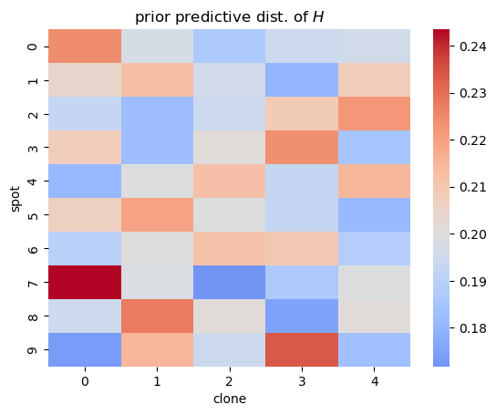

# Tumoroscope in PyMC

## Setup


```python
from dataclasses import dataclass

import arviz as az
import janitor  # noqa: F401
import numpy as np
import pandas as pd
import pymc as pm
import seaborn as sns
```

## Introduction


## Model


```python
@dataclass
class TumoroscopeData:
    """Tumoroscope model data."""

    K: int  # number of clones
    S: int  # number of spots
    F: np.ndarray  # Prevelance of clones from bulk-DNA seq.
    zeta_s: float = 1  # Pi hyper-parameter
    F_0: float = 0.01  # "pseudo-frequency" for lower bound on clone proportion
    l: float = 100  # Scaling factor to discretize F


def _prefixed_index(n: int, prefix: str) -> list[str]:
    return [f"{prefix}{i}" for i in np.arange(n)]


def _check_tumoroscope_data(data: TumoroscopeData) -> None:
    assert data.F.sum() == 1.0
    assert data.F.ndim == 1
    assert data.F.shape[0] == data.K


def _make_tumoroscope_model_coords(data: TumoroscopeData) -> dict[str, list[str]]:
    coords = {
        "clone": _prefixed_index(data.K, "c"),
        "spot": _prefixed_index(data.S, "s"),
    }
    return coords


def tumoroscope(data: TumoroscopeData) -> pm.Model:
    _check_tumoroscope_data(data)
    coords = _make_tumoroscope_model_coords(data)
    with pm.Model(coords=coords) as model:
        ζ_s = pm.ConstantData("ζ_s", data.zeta_s)
        ℓ = pm.ConstantData("ℓ", data.l)
        F = pm.ConstantData("F", data.F)
        F_prime = pm.Deterministic("F_prime", ℓ * 20 * F / 20)
        Π = pm.Beta("Π", alpha=ζ_s / data.K, beta=1, dims=("spot", "clone"))
        Z = pm.Bernoulli("Z", p=Π, dims=("spot", "clone"))
        G = pm.Gamma("G", F_prime**Z * data.F_0 ** (1 - Z), 1, dims=("spot", "clone"))
        H = pm.Deterministic("H", G / G.sum(axis=1)[:, None], dims=("spot", "clone"))
    return model
```


```python
mock_tumor_data = TumoroscopeData(K=5, S=10, F=np.ones(5) / 5.0)

m = tumoroscope(mock_tumor_data)
pm.model_to_graphviz(m)
```


```python
with m:
    prior_pred = pm.sample_prior_predictive(random_seed=123)
```

    Sampling: [G, Z, Π]


```python
H_mean = prior_pred.prior["H"].values.squeeze().mean(axis=0)
ax = sns.heatmap(data=H_mean, cmap="coolwarm", center=1 / mock_tumor_data.K)
ax.set_xlabel("clone")
ax.set_ylabel("spot")
ax.set_title("prior predictive dist. of $H$")
```


    Text(0.5, 1.0, 'prior predictive dist. of $H$')





```python

```


```python

```


```python

```


```python

```

---

## Session information


```python
%load_ext watermark
%watermark -d -u -v -iv -b -h -m
```

    Last updated: 2022-10-05

    Python implementation: CPython
    Python version       : 3.10.6
    IPython version      : 8.5.0

    Compiler    : Clang 13.0.1
    OS          : Darwin
    Release     : 21.6.0
    Machine     : x86_64
    Processor   : i386
    CPU cores   : 4
    Architecture: 64bit

    Hostname: jhcookmac.harvardsecure.wireless.med.harvard.edu

    Git branch: tumoroscope

    numpy  : 1.23.3
    pandas : 1.5.0
    seaborn: 0.12.0
    pymc   : 4.2.1
    arviz  : 0.12.1
    janitor: 0.22.0


```python

```
