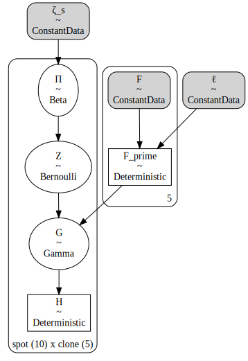
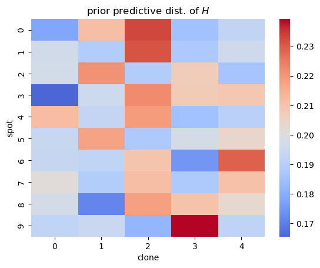

# Tumoroscope in PyMC

## Setup


```python
from dataclasses import dataclass

import arviz as az
import janitor  # noqa: F401
import matplotlib.pyplot as plt
import numpy as np
import pandas as pd
import pymc as pm
import seaborn as sns
```

## Introduction


## Model


```python
@dataclass
class TumoroscopeData:
    """Tumoroscope model data."""

    K: int  # number of clones
    S: int  # number of spots
    P: int  # number of mutation positions
    F: np.ndarray  # Prevelance of clones from bulk-DNA seq.
    Lambda: np.ndarray  # Number of cell counted per spot
    C: np.ndarray  # Zygosity per position and clone
    D_obs: np.ndarray | None  # Read count per position per spot
    A_obs: np.ndarray | None  # Alternated reads per position per spot
    zeta_s: float = 1  # Pi hyper-parameter
    F_0: float = 0.01  # "pseudo-frequency" for lower bound on clone proportion
    l: float = 100  # Scaling factor to discretize F
    r: float = 0.09  # shape parameter for Gamma over Phi
    p: float = 1  # rate parameter for Gamma over Phi


def _prefixed_index(n: int, prefix: str) -> list[str]:
    return [f"{prefix}{i}" for i in np.arange(n)]


def _check_tumoroscope_data(data: TumoroscopeData) -> None:
    assert data.F.sum() == 1.0
    assert data.F.ndim == 1
    assert data.F.shape[0] == data.K


def _make_tumoroscope_model_coords(data: TumoroscopeData) -> dict[str, list[str]]:
    coords = {
        "clone": _prefixed_index(data.K, "c"),
        "spot": _prefixed_index(data.S, "s"),
        "position": _prefixed_index(data.P, "p"),
    }
    return coords


def tumoroscope(data: TumoroscopeData) -> pm.Model:
    _check_tumoroscope_data(data)
    coords = _make_tumoroscope_model_coords(data)
    with pm.Model(coords=coords) as model:
        ζ_s = pm.ConstantData("ζ_s", data.zeta_s)
        ℓ = pm.ConstantData("ℓ", data.l)
        F_0 = pm.ConstantData("F0", data.F_0)
        F = pm.ConstantData("F", data.F)
        Λ = pm.ConstantData("Λ", data.Lambda, dims="spot")
        r = pm.ConstantData("r", data.r)
        p = pm.ConstantData("p", data.p)
        C = pm.ConstantData("C", data.C, dims=("position", "clone"))

        F_prime = pm.Deterministic("F_prime", ℓ * 20 * F / 20)

        Π = pm.Beta("Π", alpha=ζ_s / data.K, beta=1, dims=("spot", "clone"))
        Z = pm.Bernoulli("Z", p=Π, dims=("spot", "clone"))
        G = pm.Gamma("G", F_prime**Z * F_0 ** (1 - Z), 1, dims=("spot", "clone"))
        H = pm.Deterministic("H", G / G.sum(axis=1)[:, None], dims=("spot", "clone"))

        N = pm.Poisson("N", Λ, dims="spot")
        Φ = pm.Gamma("Φ", r, p, dims=("position", "clone"))
        D = pm.Poisson(
            "D", N * H.dot(Φ.T).T, dims=("position", "spot"), observed=data.D_obs
        )

        _A_num = H[:, 1:].dot((Φ[:, 1:] * C[:, 1:]).T).T
        _A_denom = H[:, 1:].dot(Φ[:, 1:].T).T
        A = pm.Binomial(
            "A", D, _A_num / _A_denom, dims=("position", "spot"), observed=data.A_obs
        )
    return model
```


```python
np.random.seed(234)
mock_tumor_data = TumoroscopeData(
    K=5,
    S=10,
    P=40,
    F=np.ones(5) / 5.0,
    Lambda=np.random.randint(1, 20, size=10),
    C=np.random.beta(2, 2, size=(40, 5)),
    D_obs=np.random.randint(2, 20, size=(40, 10)),
    A_obs=np.random.randint(2, 20, size=(40, 10)),
)

m = tumoroscope(mock_tumor_data)
pm.model_to_graphviz(m)
```





```python
with m:
    prior_pred = pm.sample_prior_predictive(random_seed=123)
```

    Sampling: [A, D, G, N, Z, Π, Φ]


```python
H_mean = prior_pred.prior["H"].values.squeeze().mean(axis=0)
ax = sns.heatmap(data=H_mean, cmap="coolwarm", center=1 / mock_tumor_data.K)
ax.set_xlabel("clone")
ax.set_ylabel("spot")
ax.set_title("prior predictive dist. of $H$")
plt.show()
```





TODO:

- generate mock data and test model
- explore prior distributions over the current user-supplied hyper-parameters
- try to use Dirichlet for $P(H|F^\prime,F_0,Z)$ like the Methods explains

## Simulation experiment


```python
np.random.seed(234)
sim_data = TumoroscopeData(
    K=5,
    S=20,
    P=40,
    F=np.asarray([0.1, 0.1, 0.25, 0.5, 0.05]),
    Lambda=np.random.randint(1, 6, size=10),
    C=np.random.beta(2, 2, size=(40, 5)),
    D_obs=None,
    A_obs=None,
)

with tumoroscope(mock_tumor_data):
    sim_data = pm.sample_prior_predictive(1, var_names=["D", "A"], random_seed=35879)
```

    Sampling: [A, D, G, N, Z, Π, Φ]


```python
sim_data.prior_predictive
```


<div><svg style="position: absolute; width: 0; height: 0; overflow: hidden">
<defs>
<symbol id="icon-database" viewBox="0 0 32 32">
<path d="M16 0c-8.837 0-16 2.239-16 5v4c0 2.761 7.163 5 16 5s16-2.239 16-5v-4c0-2.761-7.163-5-16-5z"></path>
<path d="M16 17c-8.837 0-16-2.239-16-5v6c0 2.761 7.163 5 16 5s16-2.239 16-5v-6c0 2.761-7.163 5-16 5z"></path>
<path d="M16 26c-8.837 0-16-2.239-16-5v6c0 2.761 7.163 5 16 5s16-2.239 16-5v-6c0 2.761-7.163 5-16 5z"></path>
</symbol>
<symbol id="icon-file-text2" viewBox="0 0 32 32">
<path d="M28.681 7.159c-0.694-0.947-1.662-2.053-2.724-3.116s-2.169-2.030-3.116-2.724c-1.612-1.182-2.393-1.319-2.841-1.319h-15.5c-1.378 0-2.5 1.121-2.5 2.5v27c0 1.378 1.122 2.5 2.5 2.5h23c1.378 0 2.5-1.122 2.5-2.5v-19.5c0-0.448-0.137-1.23-1.319-2.841zM24.543 5.457c0.959 0.959 1.712 1.825 2.268 2.543h-4.811v-4.811c0.718 0.556 1.584 1.309 2.543 2.268zM28 29.5c0 0.271-0.229 0.5-0.5 0.5h-23c-0.271 0-0.5-0.229-0.5-0.5v-27c0-0.271 0.229-0.5 0.5-0.5 0 0 15.499-0 15.5 0v7c0 0.552 0.448 1 1 1h7v19.5z"></path>
<path d="M23 26h-14c-0.552 0-1-0.448-1-1s0.448-1 1-1h14c0.552 0 1 0.448 1 1s-0.448 1-1 1z"></path>
<path d="M23 22h-14c-0.552 0-1-0.448-1-1s0.448-1 1-1h14c0.552 0 1 0.448 1 1s-0.448 1-1 1z"></path>
<path d="M23 18h-14c-0.552 0-1-0.448-1-1s0.448-1 1-1h14c0.552 0 1 0.448 1 1s-0.448 1-1 1z"></path>
</symbol>
</defs>
</svg>
<style>/* CSS stylesheet for displaying xarray objects in jupyterlab.
 *
 */

:root {
  --xr-font-color0: var(--jp-content-font-color0, rgba(0, 0, 0, 1));
  --xr-font-color2: var(--jp-content-font-color2, rgba(0, 0, 0, 0.54));
  --xr-font-color3: var(--jp-content-font-color3, rgba(0, 0, 0, 0.38));
  --xr-border-color: var(--jp-border-color2, #e0e0e0);
  --xr-disabled-color: var(--jp-layout-color3, #bdbdbd);
  --xr-background-color: var(--jp-layout-color0, white);
  --xr-background-color-row-even: var(--jp-layout-color1, white);
  --xr-background-color-row-odd: var(--jp-layout-color2, #eeeeee);
}

html[theme=dark],
body[data-theme=dark],
body.vscode-dark {
  --xr-font-color0: rgba(255, 255, 255, 1);
  --xr-font-color2: rgba(255, 255, 255, 0.54);
  --xr-font-color3: rgba(255, 255, 255, 0.38);
  --xr-border-color: #1F1F1F;
  --xr-disabled-color: #515151;
  --xr-background-color: #111111;
  --xr-background-color-row-even: #111111;
  --xr-background-color-row-odd: #313131;
}

.xr-wrap {
  display: block !important;
  min-width: 300px;
  max-width: 700px;
}

.xr-text-repr-fallback {
  /* fallback to plain text repr when CSS is not injected (untrusted notebook) */
  display: none;
}

.xr-header {
  padding-top: 6px;
  padding-bottom: 6px;
  margin-bottom: 4px;
  border-bottom: solid 1px var(--xr-border-color);
}

.xr-header > div,
.xr-header > ul {
  display: inline;
  margin-top: 0;
  margin-bottom: 0;
}

.xr-obj-type,
.xr-array-name {
  margin-left: 2px;
  margin-right: 10px;
}

.xr-obj-type {
  color: var(--xr-font-color2);
}

.xr-sections {
  padding-left: 0 !important;
  display: grid;
  grid-template-columns: 150px auto auto 1fr 20px 20px;
}

.xr-section-item {
  display: contents;
}

.xr-section-item input {
  display: none;
}

.xr-section-item input + label {
  color: var(--xr-disabled-color);
}

.xr-section-item input:enabled + label {
  cursor: pointer;
  color: var(--xr-font-color2);
}

.xr-section-item input:enabled + label:hover {
  color: var(--xr-font-color0);
}

.xr-section-summary {
  grid-column: 1;
  color: var(--xr-font-color2);
  font-weight: 500;
}

.xr-section-summary > span {
  display: inline-block;
  padding-left: 0.5em;
}

.xr-section-summary-in:disabled + label {
  color: var(--xr-font-color2);
}

.xr-section-summary-in + label:before {
  display: inline-block;
  content: '►';
  font-size: 11px;
  width: 15px;
  text-align: center;
}

.xr-section-summary-in:disabled + label:before {
  color: var(--xr-disabled-color);
}

.xr-section-summary-in:checked + label:before {
  content: '▼';
}

.xr-section-summary-in:checked + label > span {
  display: none;
}

.xr-section-summary,
.xr-section-inline-details {
  padding-top: 4px;
  padding-bottom: 4px;
}

.xr-section-inline-details {
  grid-column: 2 / -1;
}

.xr-section-details {
  display: none;
  grid-column: 1 / -1;
  margin-bottom: 5px;
}

.xr-section-summary-in:checked ~ .xr-section-details {
  display: contents;
}

.xr-array-wrap {
  grid-column: 1 / -1;
  display: grid;
  grid-template-columns: 20px auto;
}

.xr-array-wrap > label {
  grid-column: 1;
  vertical-align: top;
}

.xr-preview {
  color: var(--xr-font-color3);
}

.xr-array-preview,
.xr-array-data {
  padding: 0 5px !important;
  grid-column: 2;
}

.xr-array-data,
.xr-array-in:checked ~ .xr-array-preview {
  display: none;
}

.xr-array-in:checked ~ .xr-array-data,
.xr-array-preview {
  display: inline-block;
}

.xr-dim-list {
  display: inline-block !important;
  list-style: none;
  padding: 0 !important;
  margin: 0;
}

.xr-dim-list li {
  display: inline-block;
  padding: 0;
  margin: 0;
}

.xr-dim-list:before {
  content: '(';
}

.xr-dim-list:after {
  content: ')';
}

.xr-dim-list li:not(:last-child):after {
  content: ',';
  padding-right: 5px;
}

.xr-has-index {
  font-weight: bold;
}

.xr-var-list,
.xr-var-item {
  display: contents;
}

.xr-var-item > div,
.xr-var-item label,
.xr-var-item > .xr-var-name span {
  background-color: var(--xr-background-color-row-even);
  margin-bottom: 0;
}

.xr-var-item > .xr-var-name:hover span {
  padding-right: 5px;
}

.xr-var-list > li:nth-child(odd) > div,
.xr-var-list > li:nth-child(odd) > label,
.xr-var-list > li:nth-child(odd) > .xr-var-name span {
  background-color: var(--xr-background-color-row-odd);
}

.xr-var-name {
  grid-column: 1;
}

.xr-var-dims {
  grid-column: 2;
}

.xr-var-dtype {
  grid-column: 3;
  text-align: right;
  color: var(--xr-font-color2);
}

.xr-var-preview {
  grid-column: 4;
}

.xr-var-name,
.xr-var-dims,
.xr-var-dtype,
.xr-preview,
.xr-attrs dt {
  white-space: nowrap;
  overflow: hidden;
  text-overflow: ellipsis;
  padding-right: 10px;
}

.xr-var-name:hover,
.xr-var-dims:hover,
.xr-var-dtype:hover,
.xr-attrs dt:hover {
  overflow: visible;
  width: auto;
  z-index: 1;
}

.xr-var-attrs,
.xr-var-data {
  display: none;
  background-color: var(--xr-background-color) !important;
  padding-bottom: 5px !important;
}

.xr-var-attrs-in:checked ~ .xr-var-attrs,
.xr-var-data-in:checked ~ .xr-var-data {
  display: block;
}

.xr-var-data > table {
  float: right;
}

.xr-var-name span,
.xr-var-data,
.xr-attrs {
  padding-left: 25px !important;
}

.xr-attrs,
.xr-var-attrs,
.xr-var-data {
  grid-column: 1 / -1;
}

dl.xr-attrs {
  padding: 0;
  margin: 0;
  display: grid;
  grid-template-columns: 125px auto;
}

.xr-attrs dt,
.xr-attrs dd {
  padding: 0;
  margin: 0;
  float: left;
  padding-right: 10px;
  width: auto;
}

.xr-attrs dt {
  font-weight: normal;
  grid-column: 1;
}

.xr-attrs dt:hover span {
  display: inline-block;
  background: var(--xr-background-color);
  padding-right: 10px;
}

.xr-attrs dd {
  grid-column: 2;
  white-space: pre-wrap;
  word-break: break-all;
}

.xr-icon-database,
.xr-icon-file-text2 {
  display: inline-block;
  vertical-align: middle;
  width: 1em;
  height: 1.5em !important;
  stroke-width: 0;
  stroke: currentColor;
  fill: currentColor;
}
</style><pre class='xr-text-repr-fallback'>&lt;xarray.Dataset&gt;
Dimensions:   (chain: 1, draw: 1, position: 40, spot: 10)
Coordinates:
  * chain     (chain) int64 0
  * draw      (draw) int64 0
  * position  (position) &lt;U3 &#x27;p0&#x27; &#x27;p1&#x27; &#x27;p2&#x27; &#x27;p3&#x27; ... &#x27;p36&#x27; &#x27;p37&#x27; &#x27;p38&#x27; &#x27;p39&#x27;
  * spot      (spot) &lt;U2 &#x27;s0&#x27; &#x27;s1&#x27; &#x27;s2&#x27; &#x27;s3&#x27; &#x27;s4&#x27; &#x27;s5&#x27; &#x27;s6&#x27; &#x27;s7&#x27; &#x27;s8&#x27; &#x27;s9&#x27;
Data variables:
    A         (chain, draw, position, spot) int64 0 0 0 0 0 0 0 ... 0 0 0 0 0 0
    D         (chain, draw, position, spot) int64 0 0 1 0 0 0 0 ... 0 0 0 0 0 0
Attributes:
    created_at:                 2022-10-05T22:55:45.367486
    arviz_version:              0.12.1
    inference_library:          pymc
    inference_library_version:  4.2.1</pre><div class='xr-wrap' style='display:none'><div class='xr-header'><div class='xr-obj-type'>xarray.Dataset</div></div><ul class='xr-sections'><li class='xr-section-item'><input id='section-25844181-f630-44cc-9991-146b63168238' class='xr-section-summary-in' type='checkbox' disabled ><label for='section-25844181-f630-44cc-9991-146b63168238' class='xr-section-summary'  title='Expand/collapse section'>Dimensions:</label><div class='xr-section-inline-details'><ul class='xr-dim-list'><li><span class='xr-has-index'>chain</span>: 1</li><li><span class='xr-has-index'>draw</span>: 1</li><li><span class='xr-has-index'>position</span>: 40</li><li><span class='xr-has-index'>spot</span>: 10</li></ul></div><div class='xr-section-details'></div></li><li class='xr-section-item'><input id='section-a8687fc6-de8a-48f7-97ca-51114d9537eb' class='xr-section-summary-in' type='checkbox'  checked><label for='section-a8687fc6-de8a-48f7-97ca-51114d9537eb' class='xr-section-summary' >Coordinates: <span>(4)</span></label><div class='xr-section-inline-details'></div><div class='xr-section-details'><ul class='xr-var-list'><li class='xr-var-item'><div class='xr-var-name'><span class='xr-has-index'>chain</span></div><div class='xr-var-dims'>(chain)</div><div class='xr-var-dtype'>int64</div><div class='xr-var-preview xr-preview'>0</div><input id='attrs-5062a62e-a159-45f3-991f-612b7fdf103f' class='xr-var-attrs-in' type='checkbox' disabled><label for='attrs-5062a62e-a159-45f3-991f-612b7fdf103f' title='Show/Hide attributes'><svg class='icon xr-icon-file-text2'><use xlink:href='#icon-file-text2'></use></svg></label><input id='data-c0a2b1a7-8fbf-414c-a9d3-a7013e1de828' class='xr-var-data-in' type='checkbox'><label for='data-c0a2b1a7-8fbf-414c-a9d3-a7013e1de828' title='Show/Hide data repr'><svg class='icon xr-icon-database'><use xlink:href='#icon-database'></use></svg></label><div class='xr-var-attrs'><dl class='xr-attrs'></dl></div><div class='xr-var-data'><pre>array([0])</pre></div></li><li class='xr-var-item'><div class='xr-var-name'><span class='xr-has-index'>draw</span></div><div class='xr-var-dims'>(draw)</div><div class='xr-var-dtype'>int64</div><div class='xr-var-preview xr-preview'>0</div><input id='attrs-64812e53-f717-49af-8891-36ccc0cc6871' class='xr-var-attrs-in' type='checkbox' disabled><label for='attrs-64812e53-f717-49af-8891-36ccc0cc6871' title='Show/Hide attributes'><svg class='icon xr-icon-file-text2'><use xlink:href='#icon-file-text2'></use></svg></label><input id='data-584485f7-fd83-4c7a-bec6-8e670169ca2f' class='xr-var-data-in' type='checkbox'><label for='data-584485f7-fd83-4c7a-bec6-8e670169ca2f' title='Show/Hide data repr'><svg class='icon xr-icon-database'><use xlink:href='#icon-database'></use></svg></label><div class='xr-var-attrs'><dl class='xr-attrs'></dl></div><div class='xr-var-data'><pre>array([0])</pre></div></li><li class='xr-var-item'><div class='xr-var-name'><span class='xr-has-index'>position</span></div><div class='xr-var-dims'>(position)</div><div class='xr-var-dtype'>&lt;U3</div><div class='xr-var-preview xr-preview'>&#x27;p0&#x27; &#x27;p1&#x27; &#x27;p2&#x27; ... &#x27;p38&#x27; &#x27;p39&#x27;</div><input id='attrs-3816aa17-ffa8-4037-bddb-c448db693dc2' class='xr-var-attrs-in' type='checkbox' disabled><label for='attrs-3816aa17-ffa8-4037-bddb-c448db693dc2' title='Show/Hide attributes'><svg class='icon xr-icon-file-text2'><use xlink:href='#icon-file-text2'></use></svg></label><input id='data-2d4f6bf3-d57a-4937-958b-665dab4f579b' class='xr-var-data-in' type='checkbox'><label for='data-2d4f6bf3-d57a-4937-958b-665dab4f579b' title='Show/Hide data repr'><svg class='icon xr-icon-database'><use xlink:href='#icon-database'></use></svg></label><div class='xr-var-attrs'><dl class='xr-attrs'></dl></div><div class='xr-var-data'><pre>array([&#x27;p0&#x27;, &#x27;p1&#x27;, &#x27;p2&#x27;, &#x27;p3&#x27;, &#x27;p4&#x27;, &#x27;p5&#x27;, &#x27;p6&#x27;, &#x27;p7&#x27;, &#x27;p8&#x27;, &#x27;p9&#x27;, &#x27;p10&#x27;,
       &#x27;p11&#x27;, &#x27;p12&#x27;, &#x27;p13&#x27;, &#x27;p14&#x27;, &#x27;p15&#x27;, &#x27;p16&#x27;, &#x27;p17&#x27;, &#x27;p18&#x27;, &#x27;p19&#x27;, &#x27;p20&#x27;,
       &#x27;p21&#x27;, &#x27;p22&#x27;, &#x27;p23&#x27;, &#x27;p24&#x27;, &#x27;p25&#x27;, &#x27;p26&#x27;, &#x27;p27&#x27;, &#x27;p28&#x27;, &#x27;p29&#x27;, &#x27;p30&#x27;,
       &#x27;p31&#x27;, &#x27;p32&#x27;, &#x27;p33&#x27;, &#x27;p34&#x27;, &#x27;p35&#x27;, &#x27;p36&#x27;, &#x27;p37&#x27;, &#x27;p38&#x27;, &#x27;p39&#x27;],
      dtype=&#x27;&lt;U3&#x27;)</pre></div></li><li class='xr-var-item'><div class='xr-var-name'><span class='xr-has-index'>spot</span></div><div class='xr-var-dims'>(spot)</div><div class='xr-var-dtype'>&lt;U2</div><div class='xr-var-preview xr-preview'>&#x27;s0&#x27; &#x27;s1&#x27; &#x27;s2&#x27; ... &#x27;s7&#x27; &#x27;s8&#x27; &#x27;s9&#x27;</div><input id='attrs-640e2c61-2fa2-4cb1-8e45-890b59d23a39' class='xr-var-attrs-in' type='checkbox' disabled><label for='attrs-640e2c61-2fa2-4cb1-8e45-890b59d23a39' title='Show/Hide attributes'><svg class='icon xr-icon-file-text2'><use xlink:href='#icon-file-text2'></use></svg></label><input id='data-306966c6-f65d-4f36-966b-5aaefa1c6f47' class='xr-var-data-in' type='checkbox'><label for='data-306966c6-f65d-4f36-966b-5aaefa1c6f47' title='Show/Hide data repr'><svg class='icon xr-icon-database'><use xlink:href='#icon-database'></use></svg></label><div class='xr-var-attrs'><dl class='xr-attrs'></dl></div><div class='xr-var-data'><pre>array([&#x27;s0&#x27;, &#x27;s1&#x27;, &#x27;s2&#x27;, &#x27;s3&#x27;, &#x27;s4&#x27;, &#x27;s5&#x27;, &#x27;s6&#x27;, &#x27;s7&#x27;, &#x27;s8&#x27;, &#x27;s9&#x27;], dtype=&#x27;&lt;U2&#x27;)</pre></div></li></ul></div></li><li class='xr-section-item'><input id='section-cf054aa5-803d-4829-afde-c3ed632ebd61' class='xr-section-summary-in' type='checkbox'  checked><label for='section-cf054aa5-803d-4829-afde-c3ed632ebd61' class='xr-section-summary' >Data variables: <span>(2)</span></label><div class='xr-section-inline-details'></div><div class='xr-section-details'><ul class='xr-var-list'><li class='xr-var-item'><div class='xr-var-name'><span>A</span></div><div class='xr-var-dims'>(chain, draw, position, spot)</div><div class='xr-var-dtype'>int64</div><div class='xr-var-preview xr-preview'>0 0 0 0 0 0 0 1 ... 0 0 0 0 0 0 0 0</div><input id='attrs-34a2ee84-0010-46fa-9267-ba66b1e5d671' class='xr-var-attrs-in' type='checkbox' disabled><label for='attrs-34a2ee84-0010-46fa-9267-ba66b1e5d671' title='Show/Hide attributes'><svg class='icon xr-icon-file-text2'><use xlink:href='#icon-file-text2'></use></svg></label><input id='data-96170357-0b71-4558-adea-7e930336c734' class='xr-var-data-in' type='checkbox'><label for='data-96170357-0b71-4558-adea-7e930336c734' title='Show/Hide data repr'><svg class='icon xr-icon-database'><use xlink:href='#icon-database'></use></svg></label><div class='xr-var-attrs'><dl class='xr-attrs'></dl></div><div class='xr-var-data'><pre>array([[[[ 0,  0,  0,  0,  0,  0,  0,  1,  0,  0],
         [ 0,  0,  0,  0,  0,  1,  0,  0,  0,  1],
         [ 1,  0,  1,  1,  3,  0,  0,  0,  2,  0],
         [ 1,  0,  0,  0,  2,  0,  0,  0,  0,  0],
         [ 0,  0,  0,  0,  0,  0,  0,  0,  1,  0],
         [ 0,  0,  0,  0,  0,  1,  0,  0,  0,  0],
         [ 0,  0,  0,  0,  0,  0,  0,  0,  0,  0],
         [ 0,  0,  0,  0,  0,  0,  0,  0,  1,  0],
         [ 0,  0,  0,  0,  0,  0,  0,  0,  0,  0],
         [ 0,  0,  0,  2,  2,  0,  0,  0,  0,  0],
         [ 0,  0,  0,  0,  0,  0,  0,  1,  0,  0],
         [ 4,  0,  0,  1,  0,  1,  0,  1,  0,  0],
         [ 0,  0,  0,  0,  0,  0,  0,  0,  0,  0],
         [ 0,  0,  0,  0,  0,  0,  0,  0,  0,  0],
         [ 0,  0,  0,  0,  0,  1,  0,  0,  0,  0],
         [ 0,  0,  0,  0,  0,  0,  0,  0,  0,  0],
         [ 0,  0,  0,  0,  0,  0,  0,  0,  0,  1],
         [ 1,  0,  0,  2,  0,  0,  0,  0,  1,  0],
         [ 0,  0,  0,  0,  0,  0,  0,  1,  0,  0],
         [ 0,  0,  0,  0,  0,  0,  0,  0,  0,  0],
         [ 0,  0,  0,  0,  0,  0,  0,  0,  0,  0],
         [ 0,  0,  0,  0,  0,  0,  0,  1,  2,  0],
         [ 0,  0,  0,  0,  0,  2,  0,  0,  0,  1],
         [ 0,  0,  0,  0,  0,  0,  0,  0,  0,  0],
         [ 1,  0,  1,  0,  1,  0,  0,  0,  0,  0],
         [ 0,  0,  0,  0,  0,  0,  0,  0,  0,  0],
         [ 0,  0,  0,  0,  0,  0,  0,  0,  0,  0],
         [ 0,  0,  0,  0,  0, 13,  0,  0,  3,  2],
         [ 0,  0,  0,  0,  0,  0,  0,  0,  0,  0],
         [ 0,  0,  0,  0,  0,  0,  0,  0,  1,  0],
         [ 0,  0,  0,  0,  0,  3,  0,  0,  3,  2],
         [ 0,  0,  0,  0,  0,  0,  0,  0,  0,  0],
         [ 0,  1,  0,  0,  0,  1,  0,  0,  0,  0],
         [ 0,  0,  0,  0,  0,  0,  0,  0,  0,  0],
         [ 1,  0,  0,  0,  2,  0,  0,  0,  0,  0],
         [ 0,  0,  0,  0,  0,  1,  0,  0,  0,  2],
         [ 0,  0,  0,  0,  0,  0,  0,  0,  0,  0],
         [ 0,  0,  0,  0,  0,  0,  0,  0,  0,  0],
         [ 1,  0,  0,  0,  0,  2,  0,  0,  1,  0],
         [ 0,  0,  0,  0,  0,  0,  0,  0,  0,  0]]]])</pre></div></li><li class='xr-var-item'><div class='xr-var-name'><span>D</span></div><div class='xr-var-dims'>(chain, draw, position, spot)</div><div class='xr-var-dtype'>int64</div><div class='xr-var-preview xr-preview'>0 0 1 0 0 0 0 1 ... 0 0 0 0 0 0 0 0</div><input id='attrs-b1aaeb85-53a7-4bb7-9339-324043885bee' class='xr-var-attrs-in' type='checkbox' disabled><label for='attrs-b1aaeb85-53a7-4bb7-9339-324043885bee' title='Show/Hide attributes'><svg class='icon xr-icon-file-text2'><use xlink:href='#icon-file-text2'></use></svg></label><input id='data-eaf8f141-8710-4cf9-857c-c30d46330d10' class='xr-var-data-in' type='checkbox'><label for='data-eaf8f141-8710-4cf9-857c-c30d46330d10' title='Show/Hide data repr'><svg class='icon xr-icon-database'><use xlink:href='#icon-database'></use></svg></label><div class='xr-var-attrs'><dl class='xr-attrs'></dl></div><div class='xr-var-data'><pre>array([[[[ 0,  0,  1,  0,  0,  0,  0,  1,  0,  0],
         [ 0,  0,  0,  0,  0,  2,  0,  0,  0,  1],
         [ 1,  0,  1,  1,  5,  0,  0,  0,  2,  0],
         [ 3,  0,  0,  1,  3,  0,  0,  0,  0,  0],
         [ 0,  0,  0,  0,  0,  0,  0,  0,  2,  0],
         [ 0,  0,  0,  0,  0,  4,  0,  0,  0,  0],
         [ 0,  0,  0,  0,  0,  0,  0,  0,  0,  0],
         [ 0,  0,  0,  0,  0,  2,  0,  0,  1,  0],
         [ 0,  0,  0,  0,  0,  1,  0,  0,  0,  1],
         [ 0,  0,  0,  2,  2,  0,  0,  0,  0,  0],
         [ 0,  0,  0,  0,  0,  0,  0,  2,  0,  1],
         [ 4,  0,  0,  2,  1,  1,  0,  1,  0,  0],
         [ 0,  0,  0,  0,  0,  0,  0,  0,  0,  0],
         [ 0,  0,  0,  0,  0,  1,  0,  1,  1,  1],
         [ 0,  0,  0,  0,  0,  4,  0,  0,  0,  0],
         [ 0,  0,  0,  0,  0,  2,  0,  0,  0,  0],
         [ 0,  0,  0,  0,  0,  0,  0,  1,  0,  1],
         [ 6,  2,  0,  7,  7,  0,  0,  0,  3,  0],
         [ 0,  2,  0,  0,  0,  0,  0,  2,  0,  0],
         [ 0,  0,  0,  0,  0,  0,  0,  0,  0,  0],
         [ 0,  0,  0,  0,  0,  0,  0,  0,  1,  0],
         [ 0,  0,  0,  1,  0,  0,  0,  1,  3,  0],
         [ 0,  0,  1,  0,  0,  4,  0,  0,  0,  2],
         [ 0,  0,  0,  0,  0,  0,  0,  0,  0,  0],
         [ 1,  0,  1,  0,  1,  0,  0,  0,  0,  0],
         [ 0,  0,  0,  0,  0,  0,  0,  0,  0,  0],
         [ 1,  0,  0,  0,  1,  0,  0,  0,  0,  0],
         [ 0,  0,  0,  0,  0, 34,  0,  0,  7,  7],
         [ 0,  0,  0,  0,  0,  0,  0,  0,  0,  0],
         [ 0,  0,  0,  0,  0,  0,  0,  0,  1,  0],
         [ 0,  0,  0,  0,  0,  8,  0,  0,  3,  4],
         [ 0,  0,  0,  0,  0,  0,  0,  1,  0,  0],
         [ 0,  1,  0,  0,  0,  1,  0,  0,  0,  0],
         [ 0,  0,  0,  0,  0,  0,  0,  0,  0,  0],
         [12,  0,  2,  4, 11,  0,  0,  0,  4,  0],
         [ 0,  0,  0,  0,  0,  3,  0,  0,  0,  2],
         [ 0,  0,  0,  0,  0,  0,  0,  0,  0,  0],
         [ 0,  0,  0,  0,  0,  0,  0,  0,  0,  0],
         [ 1,  0,  0,  1,  2,  4,  0,  0,  1,  0],
         [ 0,  0,  0,  0,  0,  0,  0,  0,  0,  0]]]])</pre></div></li></ul></div></li><li class='xr-section-item'><input id='section-5ba042d7-c9a9-4cd1-a269-fa6829953659' class='xr-section-summary-in' type='checkbox'  checked><label for='section-5ba042d7-c9a9-4cd1-a269-fa6829953659' class='xr-section-summary' >Attributes: <span>(4)</span></label><div class='xr-section-inline-details'></div><div class='xr-section-details'><dl class='xr-attrs'><dt><span>created_at :</span></dt><dd>2022-10-05T22:55:45.367486</dd><dt><span>arviz_version :</span></dt><dd>0.12.1</dd><dt><span>inference_library :</span></dt><dd>pymc</dd><dt><span>inference_library_version :</span></dt><dd>4.2.1</dd></dl></div></li></ul></div></div>


---

## Session information


```python
%load_ext watermark
%watermark -d -u -v -iv -b -h -m
```

    Last updated: 2022-10-05

    Python implementation: CPython
    Python version       : 3.10.6
    IPython version      : 8.5.0

    Compiler    : Clang 13.0.1
    OS          : Darwin
    Release     : 21.6.0
    Machine     : x86_64
    Processor   : i386
    CPU cores   : 4
    Architecture: 64bit

    Hostname: jhcookmac.harvardsecure.wireless.med.harvard.edu

    Git branch: tumoroscope

    matplotlib: 3.6.0
    pandas    : 1.5.0
    seaborn   : 0.12.0
    janitor   : 0.22.0
    numpy     : 1.23.3
    pymc      : 4.2.1
    arviz     : 0.12.1


```python

```
