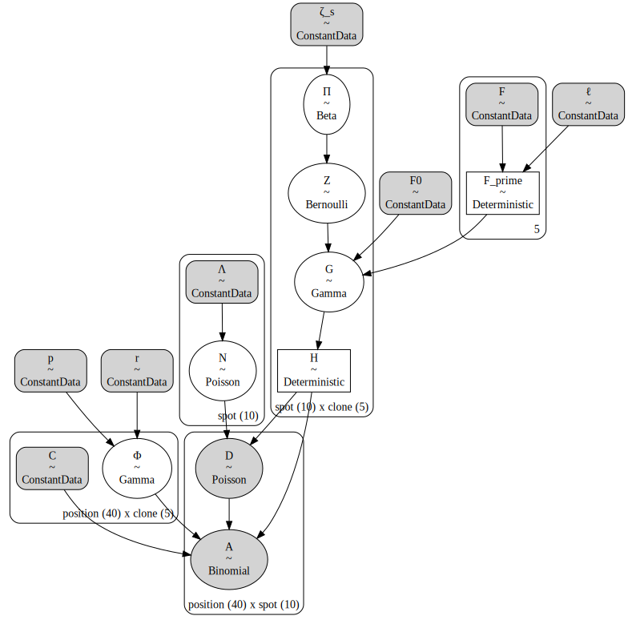
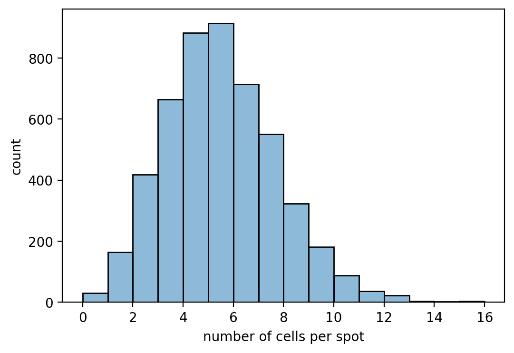
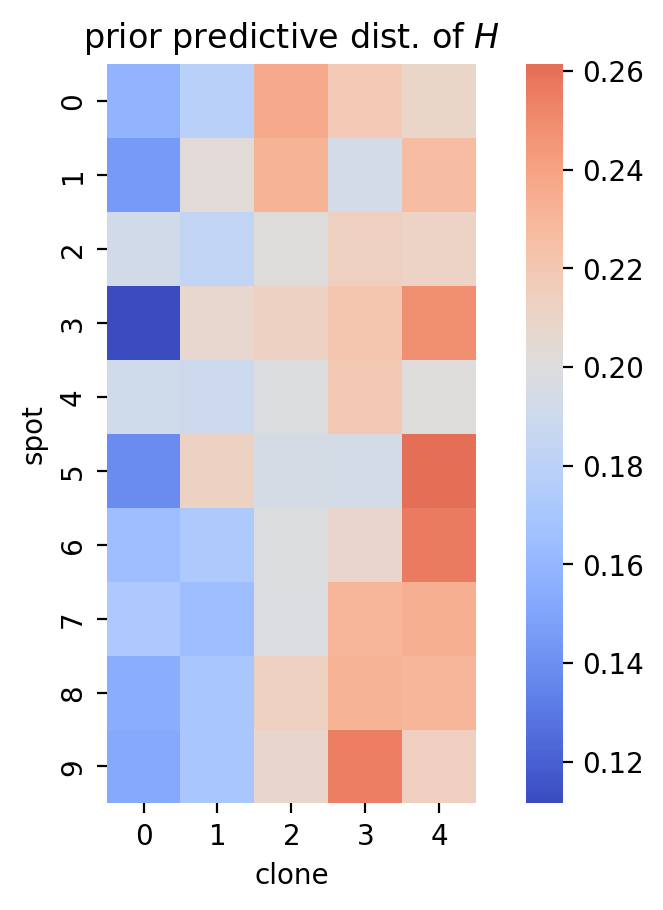

# Tumoroscope in PyMC

## Setup


```python
from dataclasses import dataclass

import arviz as az
import janitor  # noqa: F401
import matplotlib.pyplot as plt
import numpy as np
import pandas as pd
import pymc as pm
import scipy.stats
import seaborn as sns
```


```python
%matplotlib inline
%config InlineBackend.figure_format='retina'
```

## Introduction


## Model


```python
@dataclass
class TumoroscopeData:
    """Tumoroscope model data."""

    K: int  # number of clones
    S: int  # number of spots
    P: int  # number of mutation positions
    F: np.ndarray  # Prevelance of clones from bulk-DNA seq.
    Lambda: np.ndarray  # Number of cell counted per spot
    C: np.ndarray  # Zygosity per position and clone
    D_obs: np.ndarray | None  # Read count per position per spot
    A_obs: np.ndarray | None  # Alternated reads per position per spot
    zeta_s: float = 1  # Pi hyper-parameter
    F_0: float = 0.01  # "pseudo-frequency" for lower bound on clone proportion
    l: float = 100  # Scaling factor to discretize F
    r: float = 0.09  # shape parameter for Gamma over Phi
    p: float = 1  # rate parameter for Gamma over Phi


def _prefixed_index(n: int, prefix: str) -> list[str]:
    return [f"{prefix}{i}" for i in np.arange(n)]


def _check_tumoroscope_data(data: TumoroscopeData) -> None:
    assert data.F.sum() == 1.0
    assert data.F.ndim == 1
    assert data.F.shape[0] == data.K


def _make_tumoroscope_model_coords(data: TumoroscopeData) -> dict[str, list[str]]:
    coords = {
        "clone": _prefixed_index(data.K, "c"),
        "spot": _prefixed_index(data.S, "s"),
        "position": _prefixed_index(data.P, "p"),
    }
    return coords


def tumoroscope(data: TumoroscopeData) -> pm.Model:
    _check_tumoroscope_data(data)
    coords = _make_tumoroscope_model_coords(data)
    with pm.Model(coords=coords) as model:
        ζ_s = pm.ConstantData("ζ_s", data.zeta_s)
        ℓ = pm.ConstantData("ℓ", data.l)
        F_0 = pm.ConstantData("F0", data.F_0)
        F = pm.ConstantData("F", data.F)
        Λ = pm.ConstantData("Λ", data.Lambda, dims="spot")
        r = pm.ConstantData("r", data.r)
        p = pm.ConstantData("p", data.p)
        C = pm.ConstantData("C", data.C, dims=("position", "clone"))

        F_prime = pm.Deterministic("F_prime", ℓ * 20 * F / 20)

        Π = pm.Beta("Π", alpha=ζ_s / data.K, beta=1, dims=("spot", "clone"))
        Z = pm.Bernoulli("Z", p=Π, dims=("spot", "clone"))
        G = pm.Gamma("G", F_prime**Z * F_0 ** (1 - Z), 1, dims=("spot", "clone"))
        H = pm.Deterministic("H", G / G.sum(axis=1)[:, None], dims=("spot", "clone"))

        N = pm.Poisson("N", Λ, dims="spot")
        Φ = pm.Gamma("Φ", r, p, dims=("position", "clone"))
        D = pm.Poisson(
            "D", N * H.dot(Φ.T).T, dims=("position", "spot"), observed=data.D_obs
        )

        _A_num = pm.Deterministic("A_num", H[:, 1:].dot((Φ[:, 1:] * C[:, 1:]).T).T)
        _A_denom = pm.Deterministic("A_denom", H[:, 1:].dot(Φ[:, 1:].T).T)
        A = pm.Binomial(
            "A", D, _A_num / _A_denom, dims=("position", "spot"), observed=data.A_obs
        )
    return model
```


```python
np.random.seed(234)
mock_tumor_data = TumoroscopeData(
    K=5,
    S=10,
    P=40,
    F=np.ones(5) / 5.0,
    Lambda=np.random.randint(1, 20, size=10),
    C=np.random.beta(2, 2, size=(40, 5)),
    D_obs=np.random.randint(2, 20, size=(40, 10)),
    A_obs=np.random.randint(2, 20, size=(40, 10)),
)

m = tumoroscope(mock_tumor_data)
pm.model_to_graphviz(m)
```





To-Do:

- generate mock data and test model
- try to use Dirichlet for $P(H|F^\prime,F_0,Z)$ like the Methods explains

Possible improvements

- explore prior distributions over the current user-supplied hyper-parameters
- utilize spatial relationships in the estimation of clonal distributions per spot

## Prior predictive sampling


```python
example_input_data = TumoroscopeData(
    K=5,
    S=10,
    P=40,
    F=np.array([0.01, 0.05, 0.15, 0.3, 0.49]),
    Lambda=np.ones(10) * 5,
    C=np.ones((40, 5), float),
    D_obs=None,
    A_obs=None,
    r=0.19,
    p=1,
)

with tumoroscope(example_input_data) as m:
    prior_pred = pm.sample_prior_predictive(
        500,
        var_names=["D", "A", "H", "G", "Z", "Π", "Φ", "N", "A_num", "A_denom"],
        random_seed=123,
    )
```

    Sampling: [A, D, G, N, Z, Π, Φ]


```python
prior_pred.constant_data["Λ"].values
```


    array([5., 5., 5., 5., 5., 5., 5., 5., 5., 5.])


```python
_, ax = plt.subplots(figsize=(6, 4))
sns.histplot(prior_pred.prior["N"].values.flatten(), alpha=0.5, binwidth=1, ax=ax)
ax.set_xlabel("number of cells per spot")
ax.set_ylabel("count")
plt.show()
```





```python
H_mean = prior_pred.prior["H"].values.squeeze().mean(axis=0)
ax = sns.heatmap(
    data=H_mean, cmap="coolwarm", center=1 / mock_tumor_data.K, square=True
)
ax.set_xlabel("clone")
ax.set_ylabel("spot")
ax.set_title("prior predictive dist. of $H$")
plt.show()
```





```python
fig, axes = plt.subplots(ncols=2, figsize=(8, 5))
for ax, var_name in zip(axes, ["D", "A"]):
    var_prior_mean = prior_pred.prior[var_name].mean(axis=(0, 1)).values
    sns.heatmap(
        var_prior_mean,
        square=True,
        cbar_kws={"label": "average number of reads"},
        ax=ax,
    )
    ax.set_xlabel("spot")
    ax.set_ylabel("position")
    ax.set_title(var_name)
fig.tight_layout()
plt.show()
```


Average number of reads *per spot*.


```python
prior_pred.prior["D"].mean(axis=(0, 1)).sum(axis=0).values
```


    array([36.448, 38.086, 36.56 , 38.236, 39.044, 38.76 , 37.422, 36.94 ,
           37.214, 39.668])


```python
phi_prior_mean = prior_pred.prior["Φ"].mean(axis=(0, 1)).values
ax = sns.heatmap(phi_prior_mean, square=True, cbar_kws={"label": r"$\bar{\Phi}$"})
ax.set_xlabel("clone")
ax.set_ylabel("position")
plt.show()
```


## Simulation experiments


```python
# Set seed for reproducible results.
np.random.seed(8383)

# Set true underlying constants.
N_CLONES = 5
N_SPOTS = 20
n_positions = 300  # changes below

# Number of cells counted in each spot between 2 and 8 cells.
cell_counts = np.random.randint(2, 8, size=N_SPOTS)

# True mutations for each clone.
clone_mutations = np.hstack(
    [
        np.random.binomial(1, p, size=(n_positions, 1))
        for p in [0.05, 0.1, 0.2, 0.3, 0.4]
    ]
)
# Drop positions without any mutations.
clone_mutations = clone_mutations[clone_mutations.sum(axis=1) > 0, :]
n_positions = clone_mutations.shape[0]
print(f"Number of positions: {n_positions}")

# Assign probability distribution over spots for each clone.
clone_props_params = [(2, 2), (1, 3), (4, 2), (5, 5), (1, 1)]
spots_x = np.linspace(0, 1, N_SPOTS)
clone_proportions = np.hstack(
    [scipy.stats.beta(a, b).pdf(spots_x)[:, None] for a, b in clone_props_params]
)
clone_proportions = clone_proportions / clone_proportions.sum(axis=1)[:, None]

# True fraction of clones taken from the underlying distributions.
F = np.array([a / (a + b) for a, b in clone_props_params])
F = F / F.sum()

_cell_labels: list[tuple[int, int, int]] = []
clones = np.arange(N_CLONES)
for spot_i in range(N_SPOTS):
    for cell_j in range(cell_counts[spot_i]):
        clone = np.random.choice(clones, size=1, p=clone_proportions[spot_i, :])[0]
        _cell_labels.append((spot_i, cell_j, clone))
cell_labels = pd.DataFrame(_cell_labels, columns=["spot", "cell", "clone"])
cell_labels.head()
```

    Number of positions: 214


<div>
<style scoped>
    .dataframe tbody tr th:only-of-type {
        vertical-align: middle;
    }

    .dataframe tbody tr th {
        vertical-align: top;
    }

    .dataframe thead th {
        text-align: right;
    }
</style>
<table border="1" class="dataframe">
  <thead>
    <tr style="text-align: right;">
      <th></th>
      <th>spot</th>
      <th>cell</th>
      <th>clone</th>
    </tr>
  </thead>
  <tbody>
    <tr>
      <th>0</th>
      <td>0</td>
      <td>0</td>
      <td>1</td>
    </tr>
    <tr>
      <th>1</th>
      <td>0</td>
      <td>1</td>
      <td>1</td>
    </tr>
    <tr>
      <th>2</th>
      <td>0</td>
      <td>2</td>
      <td>1</td>
    </tr>
    <tr>
      <th>3</th>
      <td>0</td>
      <td>3</td>
      <td>1</td>
    </tr>
    <tr>
      <th>4</th>
      <td>1</td>
      <td>0</td>
      <td>4</td>
    </tr>
  </tbody>
</table>
</div>


```python
ax = sns.heatmap(
    clone_proportions.T,
    cmap="icefire",
    center=0.5,
    vmin=0,
    vmax=1.0,
    square=True,
    cbar_kws={"shrink": 0.4, "label": "proportion"},
)
ax.set_xlabel("spot")
ax.set_ylabel("clone")
plt.show()
```


```python
fig, axes = plt.subplots(ncols=2, figsize=(8, 4))

ax = axes[0]
for i in range(clone_proportions.shape[1]):
    x = np.arange(clone_proportions.shape[0])
    ax.plot(x, clone_proportions[:, i], label=f"{i}", alpha=0.5)
    ax.scatter(x, clone_proportions[:, i], s=5)

ax.set_xlabel("spot")
ax.set_ylabel("proportion of cells")

ax = axes[1]
clones_per_spot = (
    cell_labels.groupby(["spot", "clone"])
    .count()
    .reset_index()
    .rename(columns={"cell": "n_cells"})
    .astype({"clone": "category"})
)

sns.barplot(
    data=clones_per_spot, x="spot", y="n_cells", hue="clone", ax=ax, dodge=False
)
ax.legend(loc="upper left", bbox_to_anchor=(1, 1), title="clone")
plt.show()
```


Actual clone proportions vs. the randomly sampled clone proportions averaging across spots:


```python
F, clone_proportions.mean(axis=0)
```


    (array([0.20689655, 0.10344828, 0.27586207, 0.20689655, 0.20689655]),
     array([0.17863275, 0.21921696, 0.19198066, 0.15578497, 0.25438466]))


```python
_, ax = plt.subplots(figsize=(4, 3))
sns.histplot(cell_counts.flatten(), binwidth=1, ax=ax)
ax.set_xlabel("number of cells per spot")
ax.set_ylabel("count")
plt.show()
```


```python
cg = sns.clustermap(
    clone_mutations.T, figsize=(6, 4), dendrogram_ratio=(0.1, 0.15), cmap="Greys"
)
cg.ax_heatmap.set_xlabel("position")
cg.ax_heatmap.set_ylabel("clone")
cg.ax_heatmap.set_xticklabels([])
cg.ax_heatmap.tick_params("x", size=0)
cg.ax_col_dendrogram.set_title("Mutations in clones")
plt.show()
```


```python
clone_mutations.shape
```


    (214, 5)


```python
# Randomly assign read coverage per position per spot with min of 2 reads.
# read_coverage = np.random.poisson(10, size=(n_positions, N_SPOTS)) + 2

# Randomly assign zygosity per position for each clone.
zygosity = np.random.beta(10, 1, size=(n_positions, N_CLONES))
print(f"average zygosity: {zygosity.mean():0.2f}")

# For each cell in each spot, sample some number of reads for each position.
# Builds the matrix A for number of alternate reads per position and spot.
# alt_read_counts = (clone_mutations * zygosity).dot(clone_proportions.T) * read_coverage
alt_read_counts = np.zeros((n_positions, N_SPOTS, N_CLONES))
tot_read_counts = np.zeros((n_positions, N_SPOTS, N_CLONES))
for _, row in cell_labels.iterrows():
    alt_reads = (
        np.random.poisson(3, size=n_positions) * clone_mutations[:, row["clone"]]
    )
    alt_read_counts[:, row["spot"], row["clone"]] = alt_reads
    tot_reads = alt_reads + (1 - zygosity[:, row["clone"]]) * alt_reads
    tot_read_counts[:, row["spot"], row["clone"]] = tot_reads

alt_read_counts = alt_read_counts.sum(axis=2)
tot_read_counts = tot_read_counts.sum(axis=2)
alt_read_counts.shape
```

    average zygosity: 0.91


    (214, 20)


```python
fig, axes = plt.subplots(ncols=2, figsize=(12, 5))
sns.heatmap(tot_read_counts, cmap="Greys", ax=axes[0])
ax.set_title("Total read counts")
sns.heatmap(alt_read_counts, cmap="Greys", ax=axes[1])
ax.set_title("Alternative read counts")

for ax in axes:
    ax.tick_params(size=0)
    ax.set_xlabel("spot")
    ax.set_ylabel("position")

plt.show()
```


Number of reads per spot.


```python
tot_read_counts.sum(axis=0).round(2)
```


    array([ 111.96,  529.77,  493.38,  597.82,  543.63,  874.65, 1103.24,
            710.84,  342.02,  470.99,  492.39,  615.41,  580.12,  484.67,
            212.66,  446.87,  511.95,  599.54,  659.08,  405.28])


```python
sim_data = TumoroscopeData(
    K=N_CLONES,
    S=N_SPOTS,
    P=n_positions,
    F=F,
    Lambda=cell_counts,
    C=zygosity,
    D_obs=tot_read_counts,
    A_obs=alt_read_counts,
    zeta_s=N_CLONES,
)

with tumoroscope(mock_tumor_data):
    sim_trace = pm.sample(draws=500, tune=500, chains=2, cores=2, random_seed=10)
```


    ---------------------------------------------------------------------------

    SamplingError                             Traceback (most recent call last)

    Cell In [23], line 14
          1 sim_data = TumoroscopeData(
          2     K=N_CLONES,
          3     S=N_SPOTS,
       (...)
         10     zeta_s=N_CLONES,
         11 )
         13 with tumoroscope(mock_tumor_data):
    ---> 14     sim_trace = pm.sample(draws=500, tune=500, chains=2, cores=2, random_seed=10)


    File /usr/local/Caskroom/miniconda/base/envs/pymc-tumoroscope/lib/python3.10/site-packages/pymc/sampling.py:564, in sample(draws, step, init, n_init, initvals, trace, chain_idx, chains, cores, tune, progressbar, model, random_seed, discard_tuned_samples, compute_convergence_checks, callback, jitter_max_retries, return_inferencedata, idata_kwargs, mp_ctx, **kwargs)
        562 # One final check that shapes and logps at the starting points are okay.
        563 for ip in initial_points:
    --> 564     model.check_start_vals(ip)
        565     _check_start_shape(model, ip)
        567 sample_args = {
        568     "draws": draws,
        569     "step": step,
       (...)
        579     "discard_tuned_samples": discard_tuned_samples,
        580 }


    File /usr/local/Caskroom/miniconda/base/envs/pymc-tumoroscope/lib/python3.10/site-packages/pymc/model.py:1801, in Model.check_start_vals(self, start)
       1798 initial_eval = self.point_logps(point=elem)
       1800 if not all(np.isfinite(v) for v in initial_eval.values()):
    -> 1801     raise SamplingError(
       1802         "Initial evaluation of model at starting point failed!\n"
       1803         f"Starting values:\n{elem}\n\n"
       1804         f"Initial evaluation results:\n{initial_eval}"
       1805     )


    SamplingError: Initial evaluation of model at starting point failed!
    Starting values:
    {'Π_logodds__': array([[-1.60943791, -1.60943791, -1.60943791, -1.60943791, -1.60943791],
           [-1.60943791, -1.60943791, -1.60943791, -1.60943791, -1.60943791],
           [-1.60943791, -1.60943791, -1.60943791, -1.60943791, -1.60943791],
           [-1.60943791, -1.60943791, -1.60943791, -1.60943791, -1.60943791],
           [-1.60943791, -1.60943791, -1.60943791, -1.60943791, -1.60943791],
           [-1.60943791, -1.60943791, -1.60943791, -1.60943791, -1.60943791],
           [-1.60943791, -1.60943791, -1.60943791, -1.60943791, -1.60943791],
           [-1.60943791, -1.60943791, -1.60943791, -1.60943791, -1.60943791],
           [-1.60943791, -1.60943791, -1.60943791, -1.60943791, -1.60943791],
           [-1.60943791, -1.60943791, -1.60943791, -1.60943791, -1.60943791]]), 'Z': array([[0, 0, 0, 0, 0],
           [0, 0, 0, 0, 0],
           [0, 0, 0, 0, 0],
           [0, 0, 0, 0, 0],
           [0, 0, 0, 0, 0],
           [0, 0, 0, 0, 0],
           [0, 0, 0, 0, 0],
           [0, 0, 0, 0, 0],
           [0, 0, 0, 0, 0],
           [0, 0, 0, 0, 0]]), 'G_log__': array([[-4.60517019, -4.60517019, -4.60517019, -4.60517019, -4.60517019],
           [-4.60517019, -4.60517019, -4.60517019, -4.60517019, -4.60517019],
           [-4.60517019, -4.60517019, -4.60517019, -4.60517019, -4.60517019],
           [-4.60517019, -4.60517019, -4.60517019, -4.60517019, -4.60517019],
           [-4.60517019, -4.60517019, -4.60517019, -4.60517019, -4.60517019],
           [-4.60517019, -4.60517019, -4.60517019, -4.60517019, -4.60517019],
           [-4.60517019, -4.60517019, -4.60517019, -4.60517019, -4.60517019],
           [-4.60517019, -4.60517019, -4.60517019, -4.60517019, -4.60517019],
           [-4.60517019, -4.60517019, -4.60517019, -4.60517019, -4.60517019],
           [-4.60517019, -4.60517019, -4.60517019, -4.60517019, -4.60517019]]), 'N': array([ 9,  5,  2,  4,  8, 17,  4,  3,  9,  8]), 'Φ_log__': array([[-2.40794561, -2.40794561, -2.40794561, -2.40794561, -2.40794561],
           [-2.40794561, -2.40794561, -2.40794561, -2.40794561, -2.40794561],
           [-2.40794561, -2.40794561, -2.40794561, -2.40794561, -2.40794561],
           [-2.40794561, -2.40794561, -2.40794561, -2.40794561, -2.40794561],
           [-2.40794561, -2.40794561, -2.40794561, -2.40794561, -2.40794561],
           [-2.40794561, -2.40794561, -2.40794561, -2.40794561, -2.40794561],
           [-2.40794561, -2.40794561, -2.40794561, -2.40794561, -2.40794561],
           [-2.40794561, -2.40794561, -2.40794561, -2.40794561, -2.40794561],
           [-2.40794561, -2.40794561, -2.40794561, -2.40794561, -2.40794561],
           [-2.40794561, -2.40794561, -2.40794561, -2.40794561, -2.40794561],
           [-2.40794561, -2.40794561, -2.40794561, -2.40794561, -2.40794561],
           [-2.40794561, -2.40794561, -2.40794561, -2.40794561, -2.40794561],
           [-2.40794561, -2.40794561, -2.40794561, -2.40794561, -2.40794561],
           [-2.40794561, -2.40794561, -2.40794561, -2.40794561, -2.40794561],
           [-2.40794561, -2.40794561, -2.40794561, -2.40794561, -2.40794561],
           [-2.40794561, -2.40794561, -2.40794561, -2.40794561, -2.40794561],
           [-2.40794561, -2.40794561, -2.40794561, -2.40794561, -2.40794561],
           [-2.40794561, -2.40794561, -2.40794561, -2.40794561, -2.40794561],
           [-2.40794561, -2.40794561, -2.40794561, -2.40794561, -2.40794561],
           [-2.40794561, -2.40794561, -2.40794561, -2.40794561, -2.40794561],
           [-2.40794561, -2.40794561, -2.40794561, -2.40794561, -2.40794561],
           [-2.40794561, -2.40794561, -2.40794561, -2.40794561, -2.40794561],
           [-2.40794561, -2.40794561, -2.40794561, -2.40794561, -2.40794561],
           [-2.40794561, -2.40794561, -2.40794561, -2.40794561, -2.40794561],
           [-2.40794561, -2.40794561, -2.40794561, -2.40794561, -2.40794561],
           [-2.40794561, -2.40794561, -2.40794561, -2.40794561, -2.40794561],
           [-2.40794561, -2.40794561, -2.40794561, -2.40794561, -2.40794561],
           [-2.40794561, -2.40794561, -2.40794561, -2.40794561, -2.40794561],
           [-2.40794561, -2.40794561, -2.40794561, -2.40794561, -2.40794561],
           [-2.40794561, -2.40794561, -2.40794561, -2.40794561, -2.40794561],
           [-2.40794561, -2.40794561, -2.40794561, -2.40794561, -2.40794561],
           [-2.40794561, -2.40794561, -2.40794561, -2.40794561, -2.40794561],
           [-2.40794561, -2.40794561, -2.40794561, -2.40794561, -2.40794561],
           [-2.40794561, -2.40794561, -2.40794561, -2.40794561, -2.40794561],
           [-2.40794561, -2.40794561, -2.40794561, -2.40794561, -2.40794561],
           [-2.40794561, -2.40794561, -2.40794561, -2.40794561, -2.40794561],
           [-2.40794561, -2.40794561, -2.40794561, -2.40794561, -2.40794561],
           [-2.40794561, -2.40794561, -2.40794561, -2.40794561, -2.40794561],
           [-2.40794561, -2.40794561, -2.40794561, -2.40794561, -2.40794561],
           [-2.40794561, -2.40794561, -2.40794561, -2.40794561, -2.40794561]])}

    Initial evaluation results:
    {'Π': -107.51, 'Z': -9.12, 'G': -232.78, 'N': -18.14, 'Φ': -533.82, 'D': -10410.26, 'A': -inf}


```python

```


```python

```


```python

```

---

## Session information


```python
%load_ext watermark
%watermark -d -u -v -iv -b -h -m
```

    Last updated: 2022-10-07

    Python implementation: CPython
    Python version       : 3.10.6
    IPython version      : 8.5.0

    Compiler    : Clang 13.0.1
    OS          : Darwin
    Release     : 21.6.0
    Machine     : x86_64
    Processor   : i386
    CPU cores   : 4
    Architecture: 64bit

    Hostname: jhcookmac.harvardsecure.wireless.med.harvard.edu

    Git branch: tumoroscope

    seaborn   : 0.12.0
    scipy     : 1.9.1
    arviz     : 0.12.1
    matplotlib: 3.6.0
    numpy     : 1.23.3
    janitor   : 0.22.0
    pymc      : 4.2.1
    pandas    : 1.5.0


```python

```
