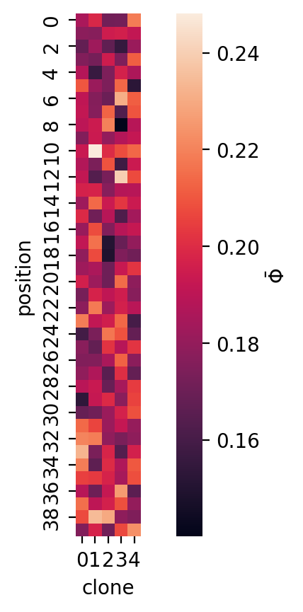
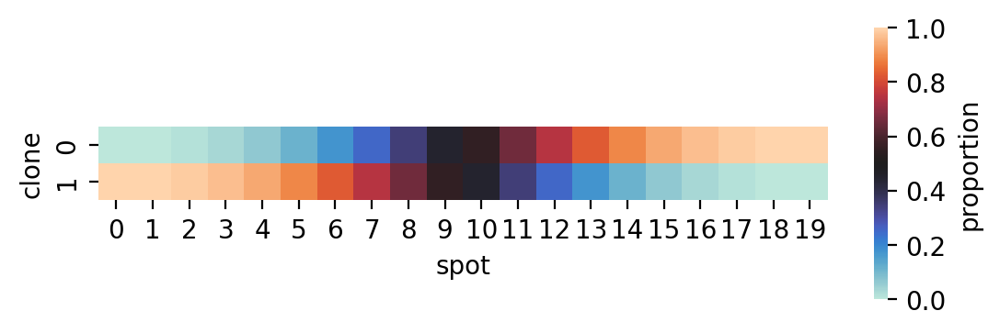
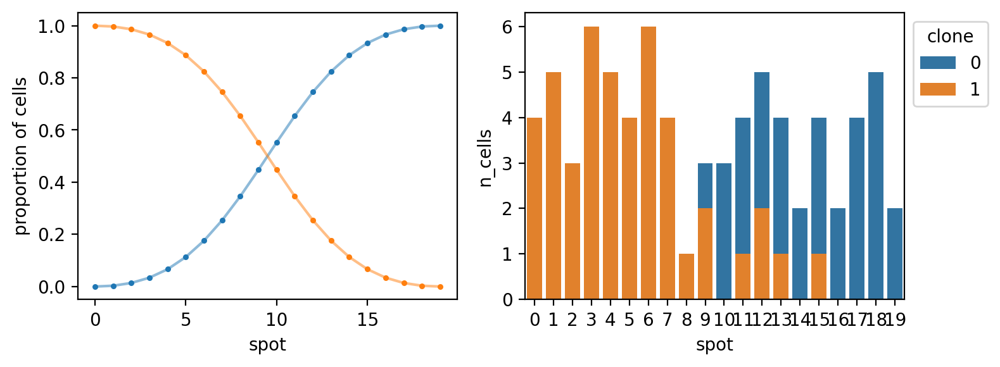
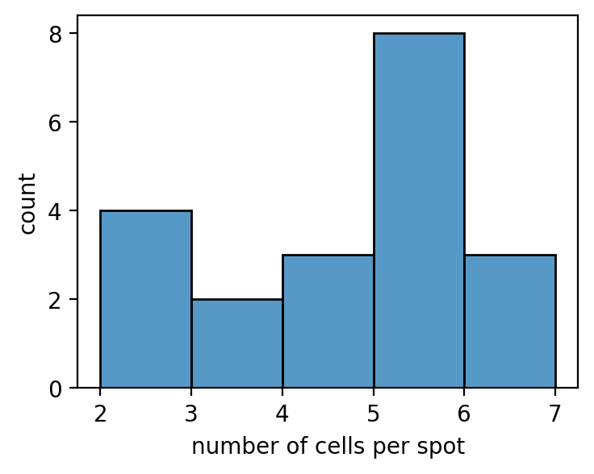
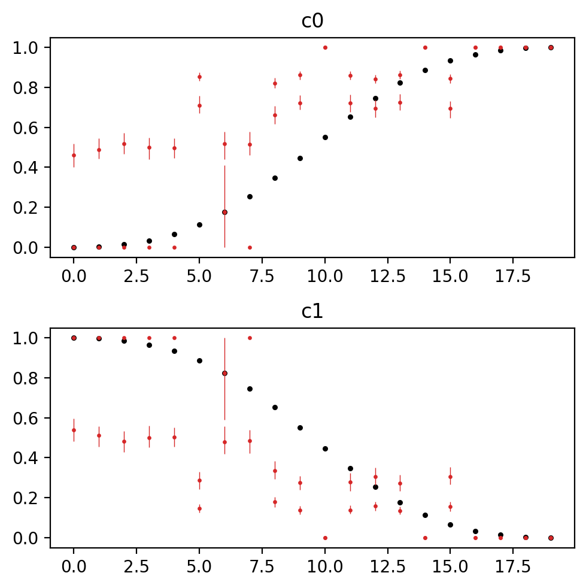

# Tumoroscope in PyMC

## Setup


```python
from dataclasses import dataclass
from pathlib import Path

import arviz as az
import janitor  # noqa: F401
import matplotlib.pyplot as plt
import numpy as np
import pandas as pd
import pymc as pm
import scipy.stats
import seaborn as sns
```


```python
%matplotlib inline
%config InlineBackend.figure_format='retina'
```


```python
# Arviz config.
az.rcparams.rcParams["stats.hdi_prob"] = 0.89

# Models directory.
models_dir = Path("models")
if not models_dir.exists():
    models_dir.mkdir()
```

## Introduction


## Model


```python
@dataclass
class TumoroscopeData:
    """Tumoroscope model data."""

    K: int  # number of clones
    S: int  # number of spots
    P: int  # number of mutation positions
    F: np.ndarray  # Prevelance of clones from bulk-DNA seq.
    Lambda: np.ndarray  # Number of cell counted per spot
    C: np.ndarray  # Zygosity per position and clone
    D_obs: np.ndarray | None  # Read count per position per spot
    A_obs: np.ndarray | None  # Alternated reads per position per spot
    zeta_s: float = 1  # Pi hyper-parameter
    F_0: float = 0.01  # "pseudo-frequency" for lower bound on clone proportion
    l: float = 100  # Scaling factor to discretize F
    r: float = 0.09  # shape parameter for Gamma over Phi
    p: float = 1  # rate parameter for Gamma over Phi


def _prefixed_index(n: int, prefix: str) -> list[str]:
    return [f"{prefix}{i}" for i in np.arange(n)]


def _check_tumoroscope_data(data: TumoroscopeData) -> None:
    assert data.F.sum() == 1.0
    assert data.F.ndim == 1
    assert data.F.shape[0] == data.K


def _make_tumoroscope_model_coords(data: TumoroscopeData) -> dict[str, list[str]]:
    coords = {
        "clone": _prefixed_index(data.K, "c"),
        "spot": _prefixed_index(data.S, "s"),
        "position": _prefixed_index(data.P, "p"),
    }
    return coords


def tumoroscope(data: TumoroscopeData) -> pm.Model:
    _check_tumoroscope_data(data)
    coords = _make_tumoroscope_model_coords(data)
    _Z_init = np.ones((data.S, data.K), dtype=int)
    with pm.Model(coords=coords) as model:
        ζ_s = pm.ConstantData("ζ_s", data.zeta_s)
        ℓ = pm.ConstantData("ℓ", data.l)
        F_0 = pm.ConstantData("F0", data.F_0)
        F = pm.ConstantData("F", data.F, dims="clone")
        Λ = pm.ConstantData("Λ", data.Lambda, dims="spot")
        r = pm.ConstantData("r", data.r)
        p = pm.ConstantData("p", data.p)
        C = pm.ConstantData("C", data.C, dims=("position", "clone"))

        F_prime = pm.Deterministic("F_prime", ℓ * 20 * F / 20, dims="clone")

        Π = pm.Beta("Π", alpha=ζ_s, beta=1, dims=("spot", "clone"))
        Z = pm.Bernoulli("Z", p=Π, dims=("spot", "clone"))  # , initval=_Z_init)
        G = pm.Gamma("G", (F_prime**Z) * (F_0 ** (1 - Z)), 1, dims=("spot", "clone"))
        H = pm.Deterministic("H", G / G.sum(axis=1)[:, None], dims=("spot", "clone"))

        N = pm.Poisson("N", Λ, dims="spot")
        Φ = pm.Gamma("Φ", r, p, dims=("position", "clone"))
        D = pm.Poisson(
            "D", N * H.dot(Φ.T).T, dims=("position", "spot"), observed=data.D_obs
        )

        _A_num = pm.Deterministic(
            "A_num", H[:, 1:].dot((Φ[:, 1:] * C[:, 1:]).T).T, dims=("position", "spot")
        )
        _A_denom = pm.Deterministic(
            "A_denom", H[:, 1:].dot(Φ[:, 1:].T).T, dims=("position", "spot")
        )
        A = pm.Binomial(
            "A", D, _A_num / _A_denom, dims=("position", "spot"), observed=data.A_obs
        )
    return model
```


```python
np.random.seed(234)
mock_tumor_data = TumoroscopeData(
    K=5,
    S=10,
    P=40,
    F=np.ones(5) / 5.0,
    Lambda=np.random.randint(1, 20, size=10),
    C=np.random.beta(2, 2, size=(40, 5)),
    D_obs=np.random.randint(2, 20, size=(40, 10)),
    A_obs=np.random.randint(2, 20, size=(40, 10)),
)

m = tumoroscope(mock_tumor_data)
pm.model_to_graphviz(m)
```


To-Do:

- generate mock data and test model
- try to use Dirichlet for $P(H|F^\prime,F_0,Z)$ like the Methods explains

Possible improvements

- explore prior distributions over the current user-supplied hyper-parameters
- utilize spatial relationships in the estimation of clonal distributions per spot

## Prior predictive sampling


```python
example_input_data = TumoroscopeData(
    K=5,
    S=10,
    P=40,
    F=np.array([0.01, 0.05, 0.15, 0.3, 0.49]),
    Lambda=np.ones(10) * 5,
    C=np.ones((40, 5), float),
    D_obs=None,
    A_obs=None,
    r=0.19,
    p=1,
)

with tumoroscope(example_input_data) as m:
    prior_pred = pm.sample_prior_predictive(
        500,
        var_names=["D", "A", "H", "G", "Z", "Π", "Φ", "N", "A_num", "A_denom"],
        random_seed=123,
    )
```

    Sampling: [A, D, G, N, Z, Π, Φ]


```python
prior_pred.constant_data["Λ"].values
```


    array([5., 5., 5., 5., 5., 5., 5., 5., 5., 5.])


```python
_, ax = plt.subplots(figsize=(6, 4))
sns.histplot(prior_pred.prior["N"].values.flatten(), alpha=0.5, binwidth=1, ax=ax)
ax.set_xlabel("number of cells per spot")
ax.set_ylabel("count")
plt.show()
```


```python
H_mean = prior_pred.prior["H"].values.squeeze().mean(axis=0)
ax = sns.heatmap(
    data=H_mean, cmap="coolwarm", center=1 / mock_tumor_data.K, square=True
)
ax.set_xlabel("clone")
ax.set_ylabel("spot")
ax.set_title("prior predictive dist. of $H$")
plt.show()
```


```python
fig, axes = plt.subplots(ncols=2, figsize=(8, 5))
for ax, var_name in zip(axes, ["D", "A"]):
    var_prior_mean = prior_pred.prior[var_name].mean(axis=(0, 1)).values
    sns.heatmap(
        var_prior_mean,
        square=True,
        cbar_kws={"label": "average number of reads"},
        ax=ax,
    )
    ax.set_xlabel("spot")
    ax.set_ylabel("position")
    ax.set_title(var_name)
fig.tight_layout()
plt.show()
```


Average number of reads *per spot*.


```python
prior_pred.prior["D"].mean(axis=(0, 1)).sum(axis=0).values
```


    array([36.912, 38.294, 36.97 , 37.696, 37.998, 38.878, 37.838, 37.492,
           37.948, 38.102])


```python
phi_prior_mean = prior_pred.prior["Φ"].mean(axis=(0, 1)).values
ax = sns.heatmap(phi_prior_mean, square=True, cbar_kws={"label": r"$\bar{\Phi}$"})
ax.set_xlabel("clone")
ax.set_ylabel("position")
plt.show()
```





## Simulation experiments


```python
_, ax = plt.subplots(figsize=(4, 2))
x = np.linspace(0, 1, 500)
y = scipy.stats.beta(1, 3).pdf(x)
ax.plot(x, y)
plt.show()
```


```python
# Set seed for reproducible results.
np.random.seed(8383)

# Set true underlying constants.
N_CLONES = 2
N_SPOTS = 20
n_positions = 300  # changes below

# Number of cells counted in each spot between 2 and 8 cells.
cell_counts = np.random.randint(2, 8, size=N_SPOTS)

# True mutations for each clone.
clone_mutations = np.hstack(
    [np.random.binomial(1, p, size=(n_positions, 1)) for p in [0.5, 0.5]]
)
# Drop positions without any mutations.
clone_mutations = clone_mutations[clone_mutations.sum(axis=1) > 0.0, :]
clone_mutations = clone_mutations[clone_mutations.mean(axis=1) < 1.0, :]
n_positions = clone_mutations.shape[0]
print(f"Number of positions: {n_positions}")

# Assign probability distribution over spots for each clone.
clone_props_params = [(3, 1), (1, 3)]
spots_x = np.linspace(0, 1, N_SPOTS)
clone_proportions = np.hstack(
    [scipy.stats.beta(a, b).pdf(spots_x)[:, None] for a, b in clone_props_params]
)
clone_proportions = clone_proportions / clone_proportions.sum(axis=1)[:, None]

# True fraction of clones taken from the underlying distributions.
F = np.array([a / (a + b) for a, b in clone_props_params])
F = F / F.sum()

_cell_labels: list[tuple[int, int, int]] = []
clones = np.arange(N_CLONES)
for spot_i in range(N_SPOTS):
    for cell_j in range(cell_counts[spot_i]):
        clone = np.random.choice(clones, size=1, p=clone_proportions[spot_i, :])[0]
        _cell_labels.append((spot_i, cell_j, clone))
cell_labels = pd.DataFrame(_cell_labels, columns=["spot", "cell", "clone"])
cell_labels.head()
```

    Number of positions: 131


<div>
<style scoped>
    .dataframe tbody tr th:only-of-type {
        vertical-align: middle;
    }

    .dataframe tbody tr th {
        vertical-align: top;
    }

    .dataframe thead th {
        text-align: right;
    }
</style>
<table border="1" class="dataframe">
  <thead>
    <tr style="text-align: right;">
      <th></th>
      <th>spot</th>
      <th>cell</th>
      <th>clone</th>
    </tr>
  </thead>
  <tbody>
    <tr>
      <th>0</th>
      <td>0</td>
      <td>0</td>
      <td>1</td>
    </tr>
    <tr>
      <th>1</th>
      <td>0</td>
      <td>1</td>
      <td>1</td>
    </tr>
    <tr>
      <th>2</th>
      <td>0</td>
      <td>2</td>
      <td>1</td>
    </tr>
    <tr>
      <th>3</th>
      <td>0</td>
      <td>3</td>
      <td>1</td>
    </tr>
    <tr>
      <th>4</th>
      <td>1</td>
      <td>0</td>
      <td>1</td>
    </tr>
  </tbody>
</table>
</div>


```python
ax = sns.heatmap(
    clone_proportions.T,
    cmap="icefire",
    center=0.5,
    vmin=0,
    vmax=1.0,
    square=True,
    cbar_kws={"shrink": 0.4, "label": "proportion"},
)
ax.set_xlabel("spot")
ax.set_ylabel("clone")
plt.show()
```





```python
fig, axes = plt.subplots(ncols=2, figsize=(8, 3))

ax = axes[0]
for i in range(clone_proportions.shape[1]):
    x = np.arange(clone_proportions.shape[0])
    ax.plot(x, clone_proportions[:, i], label=f"{i}", alpha=0.5)
    ax.scatter(x, clone_proportions[:, i], s=5)

ax.set_xlabel("spot")
ax.set_ylabel("proportion of cells")

ax = axes[1]
clones_per_spot = (
    cell_labels.groupby(["spot", "clone"])
    .count()
    .reset_index()
    .rename(columns={"cell": "n_cells"})
    .astype({"clone": "category"})
)

sns.barplot(
    data=clones_per_spot, x="spot", y="n_cells", hue="clone", ax=ax, dodge=False
)
ax.legend(loc="upper left", bbox_to_anchor=(1, 1), title="clone")
fig.tight_layout()
plt.show()
```





Actual clone proportions vs. the randomly sampled clone proportions averaging across spots:


```python
F, clone_proportions.mean(axis=0)
```


    (array([0.75, 0.25]), array([0.5, 0.5]))


```python
_, ax = plt.subplots(figsize=(4, 3))
sns.histplot(cell_counts.flatten(), binwidth=1, ax=ax)
ax.set_xlabel("number of cells per spot")
ax.set_ylabel("count")
plt.show()
```





```python
cg = sns.clustermap(
    clone_mutations.T, figsize=(6, 2), dendrogram_ratio=(0.1, 0.15), cmap="Greys"
)
cg.ax_heatmap.set_xlabel("position")
cg.ax_heatmap.set_ylabel("clone")
cg.ax_heatmap.set_xticklabels([])
cg.ax_heatmap.tick_params("x", size=0)
cg.ax_col_dendrogram.set_title("Mutations in clones")
plt.show()
```


```python
clone_mutations.shape
```


    (131, 2)


```python
# Randomly assign read coverage per position per spot with min of 2 reads.
# read_coverage = np.random.poisson(10, size=(n_positions, N_SPOTS)) + 2

# Randomly assign zygosity per position for each clone.
# zygosity = np.random.beta(10, 1, size=(n_positions, N_CLONES))
zygosity = np.ones((n_positions, N_CLONES))
print(f"average zygosity: {zygosity.mean():0.2f}")

# For each cell in each spot, sample some number of reads for each position.
# Builds the matrix A for number of alternate reads per position and spot.
# alt_read_counts = (clone_mutations * zygosity).dot(clone_proportions.T) * read_coverage
alt_read_counts = np.zeros((n_positions, N_SPOTS, N_CLONES))
tot_read_counts = np.zeros((n_positions, N_SPOTS, N_CLONES))
for _, row in cell_labels.iterrows():
    alt_reads = (
        np.random.poisson(3, size=n_positions) * clone_mutations[:, row["clone"]]
    )
    alt_read_counts[:, row["spot"], row["clone"]] = alt_reads
    tot_reads = alt_reads + (1 - zygosity[:, row["clone"]]) * alt_reads
    tot_read_counts[:, row["spot"], row["clone"]] = tot_reads

alt_read_counts = alt_read_counts.sum(axis=2)
tot_read_counts = tot_read_counts.sum(axis=2)
alt_read_counts.shape
```

    average zygosity: 1.00


    (131, 20)


```python
fig, axes = plt.subplots(ncols=2, figsize=(12, 5))
sns.heatmap(tot_read_counts, cmap="Greys", ax=axes[0])
ax.set_title("Total read counts")
sns.heatmap(alt_read_counts, cmap="Greys", ax=axes[1])
ax.set_title("Alternative read counts")

for ax in axes:
    ax.tick_params(size=0)
    ax.set_xlabel("spot")
    ax.set_ylabel("position")

plt.show()
```


Number of reads per spot.


```python
tot_read_counts.sum(axis=0).round(2)
```


    array([188., 182., 195., 194., 187., 398., 180., 177., 419., 389., 212.,
           407., 420., 397., 192., 432., 207., 230., 210., 211.])


```python
sim_data = TumoroscopeData(
    K=N_CLONES,
    S=N_SPOTS,
    P=n_positions,
    F=F,
    Lambda=cell_counts,
    C=zygosity,
    D_obs=tot_read_counts,
    A_obs=alt_read_counts,
    zeta_s=N_CLONES,
)

sim_trace_fp = models_dir / "simulation-trace.netcdf"
if sim_trace_fp.exists():
    sim_trace = az.from_netcdf(sim_trace_fp)
else:
    with tumoroscope(sim_data):
        sim_trace = pm.sample(
            draws=500, tune=1000, chains=2, cores=2, random_seed=10, target_accept=0.9
        )
    sim_trace.to_netcdf(sim_trace_fp)
```


```python
n_divs = sim_trace.sample_stats.diverging.sum(axis=1).values
print(f"Number of divergences per chain: {n_divs}")
```

    Number of divergences per chain: [13 22]


```python
fig, axes = plt.subplots(nrows=sim_data.K, figsize=(5, 2.5 * sim_data.K))
for clone_i, ax in enumerate(axes.flatten()):
    clone = f"c{clone_i}"
    ax.set_title(clone)
    spot = np.arange(sim_data.S)
    ax.scatter(spot, clone_proportions[:, clone_i], c="k", s=5, zorder=5)
    H = sim_trace.posterior["H"].sel(clone=[clone])
    for chain in H.coords["chain"]:
        ax.scatter(spot, H.sel(chain=chain).mean(axis=(0)), c="tab:red", s=2, zorder=20)
        _hdi = az.hdi(H, coords={"chain": [chain]})["H"].values.squeeze()
        ax.vlines(
            x=spot, ymin=_hdi[:, 0], ymax=_hdi[:, 1], lw=0.5, zorder=10, color="tab:red"
        )

fig.tight_layout()
plt.show()
```





```python
az.plot_trace(sim_trace, var_names=["H", "G", "N"])
plt.tight_layout()
```


```python
az.summary(sim_trace, var_names=["N"]).assign(real_values=sim_data.Lambda)
```


<div>
<style scoped>
    .dataframe tbody tr th:only-of-type {
        vertical-align: middle;
    }

    .dataframe tbody tr th {
        vertical-align: top;
    }

    .dataframe thead th {
        text-align: right;
    }
</style>
<table border="1" class="dataframe">
  <thead>
    <tr style="text-align: right;">
      <th></th>
      <th>mean</th>
      <th>sd</th>
      <th>hdi_5.5%</th>
      <th>hdi_94.5%</th>
      <th>mcse_mean</th>
      <th>mcse_sd</th>
      <th>ess_bulk</th>
      <th>ess_tail</th>
      <th>r_hat</th>
      <th>real_values</th>
    </tr>
  </thead>
  <tbody>
    <tr>
      <th>N[s0]</th>
      <td>3.341</td>
      <td>0.501</td>
      <td>3.0</td>
      <td>4.0</td>
      <td>0.262</td>
      <td>0.203</td>
      <td>4.0</td>
      <td>4.0</td>
      <td>1.55</td>
      <td>4</td>
    </tr>
    <tr>
      <th>N[s1]</th>
      <td>3.077</td>
      <td>0.267</td>
      <td>3.0</td>
      <td>3.0</td>
      <td>0.073</td>
      <td>0.053</td>
      <td>13.0</td>
      <td>13.0</td>
      <td>1.14</td>
      <td>5</td>
    </tr>
    <tr>
      <th>N[s2]</th>
      <td>2.969</td>
      <td>0.210</td>
      <td>3.0</td>
      <td>3.0</td>
      <td>0.031</td>
      <td>0.022</td>
      <td>61.0</td>
      <td>373.0</td>
      <td>1.06</td>
      <td>3</td>
    </tr>
    <tr>
      <th>N[s3]</th>
      <td>3.065</td>
      <td>0.247</td>
      <td>3.0</td>
      <td>3.0</td>
      <td>0.053</td>
      <td>0.038</td>
      <td>22.0</td>
      <td>22.0</td>
      <td>1.07</td>
      <td>6</td>
    </tr>
    <tr>
      <th>N[s4]</th>
      <td>3.056</td>
      <td>0.230</td>
      <td>3.0</td>
      <td>3.0</td>
      <td>0.048</td>
      <td>0.035</td>
      <td>23.0</td>
      <td>23.0</td>
      <td>1.10</td>
      <td>5</td>
    </tr>
    <tr>
      <th>N[s5]</th>
      <td>11.667</td>
      <td>1.290</td>
      <td>10.0</td>
      <td>13.0</td>
      <td>0.686</td>
      <td>0.532</td>
      <td>4.0</td>
      <td>6.0</td>
      <td>1.60</td>
      <td>5</td>
    </tr>
    <tr>
      <th>N[s6]</th>
      <td>2.990</td>
      <td>0.403</td>
      <td>2.0</td>
      <td>3.0</td>
      <td>0.143</td>
      <td>0.107</td>
      <td>8.0</td>
      <td>20.0</td>
      <td>1.18</td>
      <td>6</td>
    </tr>
    <tr>
      <th>N[s7]</th>
      <td>2.977</td>
      <td>0.220</td>
      <td>3.0</td>
      <td>3.0</td>
      <td>0.029</td>
      <td>0.021</td>
      <td>60.0</td>
      <td>261.0</td>
      <td>1.04</td>
      <td>4</td>
    </tr>
    <tr>
      <th>N[s8]</th>
      <td>10.626</td>
      <td>1.017</td>
      <td>9.0</td>
      <td>12.0</td>
      <td>0.452</td>
      <td>0.340</td>
      <td>5.0</td>
      <td>19.0</td>
      <td>1.35</td>
      <td>2</td>
    </tr>
    <tr>
      <th>N[s9]</th>
      <td>11.757</td>
      <td>1.345</td>
      <td>9.0</td>
      <td>13.0</td>
      <td>0.755</td>
      <td>0.592</td>
      <td>3.0</td>
      <td>9.0</td>
      <td>1.66</td>
      <td>5</td>
    </tr>
    <tr>
      <th>N[s10]</th>
      <td>8.093</td>
      <td>1.799</td>
      <td>6.0</td>
      <td>10.0</td>
      <td>1.146</td>
      <td>0.932</td>
      <td>3.0</td>
      <td>3.0</td>
      <td>2.07</td>
      <td>3</td>
    </tr>
    <tr>
      <th>N[s11]</th>
      <td>11.996</td>
      <td>1.434</td>
      <td>10.0</td>
      <td>14.0</td>
      <td>0.767</td>
      <td>0.595</td>
      <td>4.0</td>
      <td>9.0</td>
      <td>1.60</td>
      <td>5</td>
    </tr>
    <tr>
      <th>N[s12]</th>
      <td>10.505</td>
      <td>1.119</td>
      <td>9.0</td>
      <td>12.0</td>
      <td>0.582</td>
      <td>0.449</td>
      <td>4.0</td>
      <td>6.0</td>
      <td>1.52</td>
      <td>7</td>
    </tr>
    <tr>
      <th>N[s13]</th>
      <td>12.601</td>
      <td>1.513</td>
      <td>10.0</td>
      <td>14.0</td>
      <td>0.820</td>
      <td>0.638</td>
      <td>3.0</td>
      <td>64.0</td>
      <td>1.62</td>
      <td>5</td>
    </tr>
    <tr>
      <th>N[s14]</th>
      <td>7.301</td>
      <td>1.599</td>
      <td>5.0</td>
      <td>9.0</td>
      <td>1.038</td>
      <td>0.850</td>
      <td>3.0</td>
      <td>5.0</td>
      <td>2.16</td>
      <td>2</td>
    </tr>
    <tr>
      <th>N[s15]</th>
      <td>11.237</td>
      <td>1.222</td>
      <td>9.0</td>
      <td>13.0</td>
      <td>0.619</td>
      <td>0.476</td>
      <td>4.0</td>
      <td>45.0</td>
      <td>1.54</td>
      <td>5</td>
    </tr>
    <tr>
      <th>N[s16]</th>
      <td>8.406</td>
      <td>1.864</td>
      <td>6.0</td>
      <td>11.0</td>
      <td>1.214</td>
      <td>0.995</td>
      <td>3.0</td>
      <td>6.0</td>
      <td>2.06</td>
      <td>2</td>
    </tr>
    <tr>
      <th>N[s17]</th>
      <td>8.351</td>
      <td>1.993</td>
      <td>6.0</td>
      <td>11.0</td>
      <td>1.279</td>
      <td>1.043</td>
      <td>3.0</td>
      <td>4.0</td>
      <td>2.07</td>
      <td>4</td>
    </tr>
    <tr>
      <th>N[s18]</th>
      <td>9.964</td>
      <td>2.402</td>
      <td>7.0</td>
      <td>13.0</td>
      <td>1.566</td>
      <td>1.284</td>
      <td>3.0</td>
      <td>6.0</td>
      <td>2.01</td>
      <td>5</td>
    </tr>
    <tr>
      <th>N[s19]</th>
      <td>8.652</td>
      <td>1.884</td>
      <td>6.0</td>
      <td>11.0</td>
      <td>1.226</td>
      <td>1.004</td>
      <td>3.0</td>
      <td>10.0</td>
      <td>2.06</td>
      <td>2</td>
    </tr>
  </tbody>
</table>
</div>


---

## Session information


```python
%load_ext watermark
%watermark -d -u -v -iv -b -h -m
```

    Last updated: 2022-10-08

    Python implementation: CPython
    Python version       : 3.10.6
    IPython version      : 8.5.0

    Compiler    : Clang 13.0.1
    OS          : Darwin
    Release     : 21.6.0
    Machine     : x86_64
    Processor   : i386
    CPU cores   : 4
    Architecture: 64bit

    Hostname: JHCookMac.local

    Git branch: tumoroscope

    pandas    : 1.5.0
    scipy     : 1.9.1
    janitor   : 0.22.0
    numpy     : 1.23.3
    pymc      : 4.2.1
    arviz     : 0.12.1
    matplotlib: 3.6.0
    seaborn   : 0.12.0


```python

```
